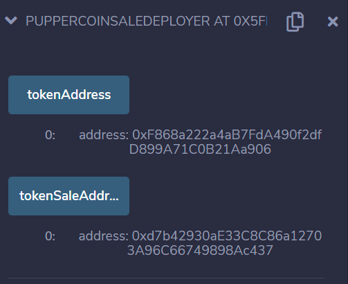
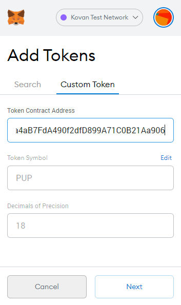
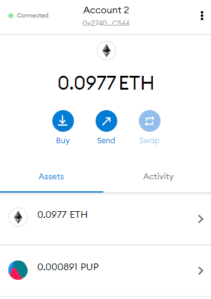

# Advanced_solidity

In this project, I created crowdsale functionality within solidity

The functionality is fully custamizable and can be used to make tokens of whatever name and symbol with 
the desired supply

The contract for **puppercoin** inherits the following contracts from *OpenZeppelin*:

* ERC20
* ERC20Detailed
* ERC20Mintable

The contract for the **crowdsale** inherits the following contracts from *OpenZeppelin*:

* Crowdsale
* MintedCrowdsale
* CappedCrowdsale
* TimedCrowdsale
* RefundablePostDeliveryCrowdsale

When **PupperCoinSaleDeployer** is deployed, the following addresses are created:

To add **PupperCoin** to metamask, simply *Add Token*, click on the *Custom Token* tab, then input the above address into *Token Contract Address*

The following shows a successful transaction into a second address

